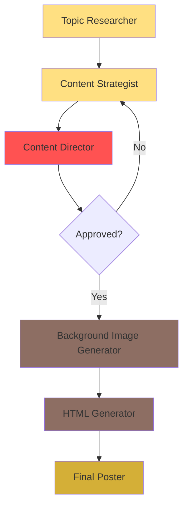

# Bake Me A Wish - Social Media Content Generation Workflow

This document describes the complete automated pipeline for generating social media posts for Bake Me A Wish.

## Overview

The workflow consists of 5 sequential AI agents, each with a specific role in the content creation process. The output is a ready-to-post HTML-based social media graphic.



## Workflow Stages

### 1. Topic Researcher ("The Flavor Hunter")

**Purpose**: Generate viral-worthy content hooks

**Input**:
- Domain: Gourmet Bakery
- Content History Log (to avoid repetition)

**Process**:
- Identifies "Hidden Villains" (problems/myths in generic baking)
- Positions "Secret Heroes" (handcrafted custom cakes from Bake Me A Wish)
- Creates 2-4 word viral hooks using sensory vocabulary

**Output**: 
- A single topic phrase (e.g., "Hidden Hunger", "Energy Vampire", "Silent Killer")

**File**: [`topic-resercher.md`](file:///Users/abhinavagarwal/Documents/Developer/prompts-CLassified/social-media/bakemeawish/topic-resercher.md)

---

### 2. Content Strategist ("The Celebration Architect")

**Purpose**: Transform the topic into structured social media content

**Input**:
- Topic from Topic Researcher

**Process**:
- Analyzes the topic to determine content type
- Selects appropriate visual theme:
  - **Classic Rustic**: Warm, traditional (ingredients, recipes)
  - **Modern Pop**: Bold, energetic (sales, fun facts)
  - **Elegant Luxury**: Premium, sophisticated (gifting, celebrations)
- Chooses layout structure:
  - **Comparison**: VS Split, VS Diagonal, VS Cards
  - **Lists**: Bullets, Timeline, Grid Features
  - **Showcase**: Hero Full Focus, Product Badge
  - **Text/Quotes**: Quote Block, Typography
  - **Engagement**: Poll, This-or-That, Trivia
  - **Announcements**: Breaking News, Event Ticket

**Output** (JSON):
```json
{
  "visual_theme": "Classic Rustic | Modern Pop | Elegant Luxury",
  "layout_category": "Comparison | Lists | Showcase | Text | Engagement | Announcements",
  "layout_type": "Specific layout name",
  "headline": "Main punchy title (max 7 words)",
  "sub_text": "Supporting text/bullet points",
  "visual_description": "Description of needed background image",
  "color_palette_hint": "e.g., Pastel Pink & Gold"
}
```

**File**: [`content-stratigist.md`](file:///Users/abhinavagarwal/Documents/Developer/prompts-CLassified/social-media/bakemeawish/content-stratigist.md)

---

### 3. Content Director ("The Aesthetic Baker")

**Purpose**: Quality assurance and creative optimization

**Input**:
- Content JSON from Content Strategist

**Process**:
- Evaluates **Theme Match**: Does visual theme fit content vibe?
- Checks **Layout Fit**: Does text structure match layout type?
- Assesses **Visual Interest**: Is the visual description specific enough?

**Output**:
- **Status**: APPROVED or REJECTED
- **Critique**: One sentence explanation
- **Revised JSON**: (only if rejected) - improved version sent back to loop

**File**: [`content-director.md`](file:///Users/abhinavagarwal/Documents/Developer/prompts-CLassified/social-media/bakemeawish/content-director.md)

---

### 4. Background Image Generator

**Purpose**: Create authentic, premium background images

**Input**:
- Topic from Topic Researcher

**Process**:
- Interprets the topic within gourmet bakery context
- Generates UGC-style (User Generated Content) photography
- Creates text-overlay friendly compositions

**Specifications**:
- **Aspect Ratio**: 9:16 (vertical/portrait)
- **Style**: Authentic, natural lighting, high texture
- **Vibe**: Warm, artisanal, joyful, premium
- **Colors**: Soft pastels, golden hues, appetizing tones

**Constraints**:
- NO text in image
- NOT stock photography aesthetic
- Must support text overlay

**Output**: 
- High-quality image URL/file

**File**: [`background-image.md`](file:///Users/abhinavagarwal/Documents/Developer/prompts-CLassified/social-media/bakemeawish/background-image.md)

---

### 5. HTML Generator

**Purpose**: Create final social media poster

**Input**:
- **IMAGE**: Background image URL from Background Image Generator
- **TEXT**: Content description from Content Strategist (approved)

**Process**:
- Analyzes TEXT to determine optimal layout approach
- Selects appropriate color palette (Classic Rustic/Modern Pop/Elegant Luxury)
- Generates complete HTML with embedded CSS
- Uses background image with proper overlays for text readability

**Specifications**:
- **Canvas**: 1080px × 1350px (Instagram portrait)
- **Typography**: Playfair Display, Outfit, Abril Fatface, Permanent Marker
- **Branding**: "BAKE ME A WISH" footer at bottom center

**Output**: 
- Complete HTML file ready for poster conversion

**File**: [`html-generator.md`](file:///Users/abhinavagarwal/Documents/Developer/prompts-CLassified/social-media/bakemeawish/html-generator.md)

---

## Implementation Notes

### n8n Flow Configuration

The workflow is typically implemented in n8n with the following node structure:

1. **Trigger**: Manual or scheduled
2. **AI Agent Node 1**: Topic Researcher
3. **AI Agent Node 2**: Content Strategist (receives topic)
4. **AI Agent Node 3**: Content Director (receives content JSON)
5. **If Node**: Check if APPROVED
   - Yes → Continue to node 6
   - No → Loop back to node 2 with revisions
6. **AI Image Generation Node**: Background Image (receives topic)
7. **AI Agent Node 4**: HTML Generator (receives image URL + content)
8. **HTML to Image Converter**: Final poster generation
9. **Storage/Publishing**: Save to cloud/post to social media

### Data Flow

```
Topic Researcher Output → Content Strategist Input
                       ↓
Content Strategist Output → Content Director Input
                       ↓
Content Director Output → {Approve/Reject Decision}
                       ↓
         Approved → Background Image Generator Input (receives original Topic)
                       ↓
         Image URL → HTML Generator Input (IMAGE)
         Content JSON → HTML Generator Input (TEXT)
                       ↓
                  HTML Output → Poster
```

## File Structure

```
social-media/bakemeawish/
├── project-overview.md           # Brand overview and objectives
├── topic-resercher.md           # Stage 1: Topic generation
├── content-stratigist.md        # Stage 2: Content creation
├── content-director.md          # Stage 3: QA/Audit
├── background-image.md          # Stage 4: Image generation
├── html-generator.md            # Stage 5: HTML poster creation
└── WORKFLOW.md                  # This file
```

## Version History

- **v1.0** (2026-02-17): Initial documentation of workflow
  - Updated `html-generator.md` to dynamic LLM prompt
  - Enhanced `background-image.md` with detailed guidelines
  - Documented complete pipeline
