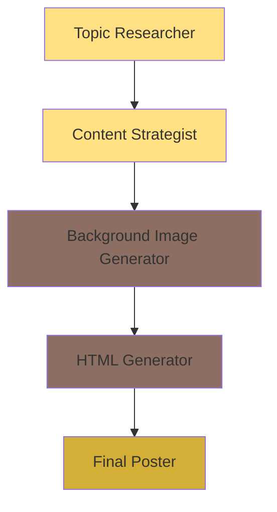

# Bake Me A Wish - Social Media Content Generation Workflow

This document describes the complete automated pipeline for generating social media posts for Bake Me A Wish.

## Overview

The workflow consists of 4 sequential AI agents. Content Director has been removed - Content Strategist includes self-check validation. Output is a ready-to-post HTML-based social media graphic.



## Workflow Stages

### 1. Topic Researcher ("The Flavor Hunter")

**Purpose**: Generate viral-worthy content hooks

**Input**:
- Domain: Gourmet Bakery (Lucknow)
- Content History Log (to avoid repetition)
- Theme (optional)

**Process**:
- Identifies "Hidden Villains" (problems/myths in generic baking)
- Positions "Secret Heroes" (handcrafted custom cakes from Bake Me A Wish)
- Creates 2-4 word viral hooks using sensory vocabulary

**Output**: 
- A single topic phrase (e.g., "Hidden Hunger", "Plastic Frosting", "Real Vanilla Story")

**File**: [`topic-resercher.md`](topic-resercher.md)

---

### 2. Content Strategist ("The Content Creator")

**Purpose**: Create compelling social media copy (with built-in self-check - no Content Director)

**Input**:
- Topic from Topic Researcher

**Process**:
- Interprets the topic in the context of gourmet bakery/celebrations
- Creates engaging copy in Quote, List, or Announcement format (NOT comparison)
- Self-checks: no comparison format, no health topics, all 5 fields present

**Output** (JSON):
```json
{
  "headline": "Punchy 5-7 word title",
  "content": "Supporting content (quote, list, or announcement - NOT comparison)",
  "caption": "Full Instagram caption (2-4 sentences) with emotional hook and CTA",
  "engagement_prompt": "Tag a friend who... / Comment below: ...",
  "hashtags": ["#bakemeawish", "#lucknowcakes", "..."]
}
```

**Note**: Caption, hashtags, and engagement_prompt are for the Instagram post caption - not rendered in the HTML poster. The HTML Generator receives only `headline` and `content` for the visual.

**File**: [`content-stratigist.md`](content-stratigist.md)

---

### 3. Background Image Generator

**Purpose**: Create authentic, premium background images

**Input**:
- Topic from Topic Researcher

**Process**:
- Interprets the topic within gourmet bakery context
- Generates UGC-style (User Generated Content) photography
- Creates text-overlay friendly compositions
- Prefers light, warm backgrounds (avoids dark for comparison content)

**Specifications**:
- **Aspect Ratio**: 9:16 (vertical/portrait)
- **Style**: Authentic, natural lighting, high texture
- **Vibe**: Warm, artisanal, joyful, premium

**Output**: 
- High-quality image URL/file

**File**: [`background-image.md`](background-image.md)

---

### 4. HTML Generator

**Purpose**: Create final social media poster

**Input**:
- **IMAGE**: Background image URL from Background Image Generator
- **TEXT**: Content (headline + content) from Content Strategist

**Process**:
- Analyzes TEXT to determine optimal layout approach
- Selects appropriate color palette (Classic Rustic/Modern Pop preferred for light backgrounds)
- Generates complete HTML with embedded CSS
- Uses background image with proper overlays for text readability

**Output**: 
- Complete HTML file ready for poster conversion

**File**: [`html-generator.md`](html-generator.md)

---

## Implementation Notes

### n8n Flow Configuration

The workflow is implemented in n8n with the following node structure (Content Director removed):

1. **Trigger**: Manual or scheduled
2. **AI Agent Node 1**: Topic Researcher
3. **AI Agent Node 2**: Content Strategist (receives topic)
4. **AI Image Generation Node**: Background Image (receives topic)
5. **AI Agent Node 3**: HTML Generator (receives image URL + headline + content)
6. **HTML to Image Converter**: Final poster generation
7. **Storage/Publishing**: Save to cloud/post to social media (use caption, engagement_prompt, hashtags for Instagram)

### Data Flow

```
Topic Researcher Output → Content Strategist Input
                       ↓
Content Strategist Output (headline, content, caption, engagement_prompt, hashtags)
                       ↓
         Topic → Background Image Generator Input
         headline + content → HTML Generator Input (TEXT) [for visual poster]
         caption + engagement_prompt + hashtags → Instagram Post Caption [for publishing]
                       ↓
         Image URL → HTML Generator Input (IMAGE)
                       ↓
                  HTML Output → Poster
```

## File Structure

```
social-media/bakemeawish/
├── project-overview.md           # Brand overview and objectives
├── topic-resercher.md            # Stage 1: Topic generation
├── content-stratigist.md         # Stage 2: Content creation (includes self-check)
├── background-image.md           # Stage 3: Image generation
├── html-generator.md            # Stage 4: HTML poster creation
├── content-director.md          # DEPRECATED - no longer used in workflow
└── WORKFLOW.md                  # This file
```

## Version History

- **v1.0** (2026-02-17): Initial documentation of workflow
- **v2.0** (2026-02-17): Content/Presentation separation
- **v3.0** (2026-02-24): Lucknow localization, multi-segment audience, caption/hashtag extension
- **v4.0** (2026-02-24): Removed Content Director - Content Strategist now includes self-check validation. Simplified to 4-stage workflow.
